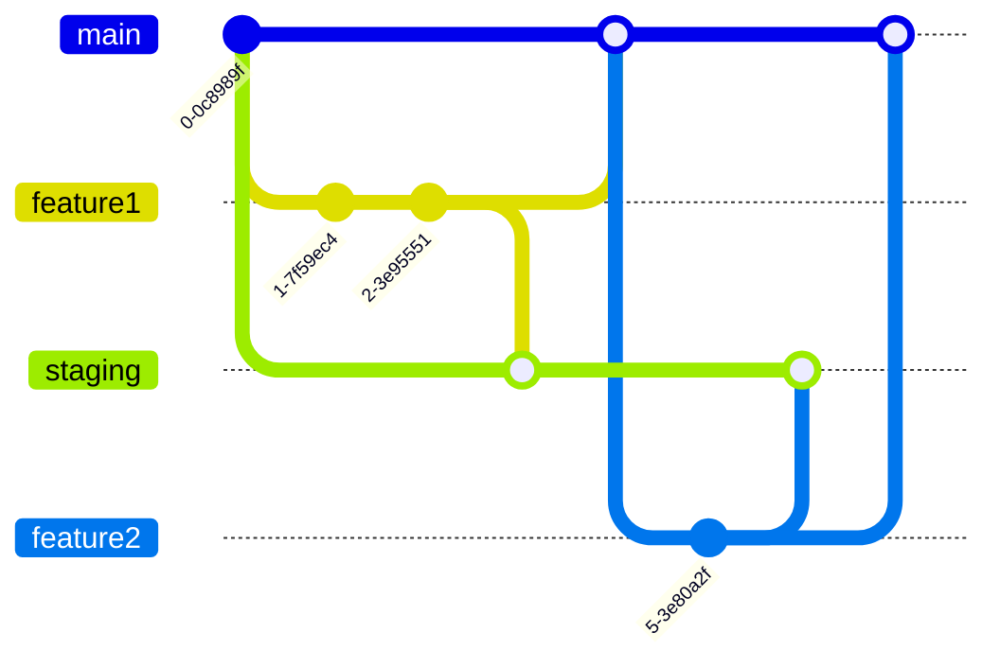

## 概要
フィッツプラス システム開発部の伊藤です。

今回の記事では、GitHub Actionsを使って、ブランチのマージ作業を効率化する方法について紹介します。
日頃の開発業務で発生するちょっとした手間を減らし、開発のスピードを上げるための工夫です。

## Branch Mergerワークフロー

ブランチのマージ作業を行うGitHub Actionsワークフローを「Branch Merger」と名付けました。

このワークフローは、GitHubのプルリクエスト内で下記のようにコメントすることで起動します。

```
/merge <マージ先のブランチ名>
```

上記のコメントをすると、プルリクエストのブランチが`<マージ先のブランチ名>`ブランチにマージされます。

例えば、

```
/merge staging
```

とコメントすると、プルリクエストのブランチが`staging`ブランチにマージされます。

## GitHub Actionsワークフローのコード

GitHub Actionsワークフローのコードは以下です。

```yaml:.github/workflows/branch-merger.yml
# PRでのコメントで指定されたブランチにマージするGitHub Actionsワークフロー
# 使い方：
# プルリクエストに対してコメントで `/merge <branch_name>` と記述します。
# 例: `/merge staging`

name: Branch Merger

on:
  issue_comment:
    types: [created]
  workflow_call:
    inputs:
      comment_body:
        required: true
        type: string
        description: 'マージ対象のブランチ名を含むコメント (例: `/merge staging`)'
      pr_number:
        required: true
        type: number
        description: 'プルリクエストの番号'
      comment_id:
        required: true
        type: number
        description: 'コメントのID'
      slack_channel_id:
        required: false
        type: string
        default: 'Slack channel ID'
        description: '通知先のSlackチャンネルID'
    secrets:
      BRANCH_MERGER_APP_ID:
        required: true
      BRANCH_MERGER_PRIVATE_KEY:
        required: true
      SLACK_OAUTH_TOKEN:
        required: true

jobs:
  merge-branch:
    # プルリクエストに対するコメントで、`/merge <branch_name>` の形式で指定されたブランチにマージする
    # この組織のメンバーのみが実行可能
    if: |
      (github.event.issue.pull_request && startsWith(github.event.comment.body, '/merge ') && github.event.comment.author_association == 'MEMBER') ||
      (github.event_name == 'workflow_call')
    runs-on: ubuntu-latest
    permissions:
      contents: write # マージとプッシュのために必要
      pull-requests: write # PRのブランチのheadを取得するためにreadが必要。また、リアクションをする為にwriteが必要
      issues: write # コメントにリアクションを追加するために必要
    outputs:
      target_branch: ${{ steps.target_branch.outputs.branch_name }}
      source_branch: ${{ steps.current_branch.outputs.branch_name }}
    steps:
      - name: Generate GitHub App token
        id: app-token
        uses: actions/create-github-app-token@v2
        with:
          app-id: ${{ secrets.BRANCH_MERGER_APP_ID }}
          private-key: ${{ secrets.BRANCH_MERGER_PRIVATE_KEY }}

      - name: Add `:+1:` reaction to comment
        continue-on-error: true
        env:
          GITHUB_TOKEN: ${{ steps.app-token.outputs.token }}
          COMMENT_ID: ${{ github.event.comment.id || inputs.comment_id }}
        run: |
          gh api \
            -H "Accept: application/vnd.github+json" \
            -X POST \
            "/repos/${{ github.repository }}/issues/comments/${COMMENT_ID}/reactions" \
            -f content="+1"

      - name: Extract target branch name from comment
        id: target_branch
        env:
          COMMENT_BODY: ${{ github.event.comment.body || inputs.comment_body }}
        run: |
          BRANCH=$(echo "${COMMENT_BODY}" | sed -nE 's/^\/merge[[:space:]]+([^[:space:]]+).*/\1/p') # コメントからブランチ名を抽出
          if [ -z "$BRANCH" ]; then
            echo "Error: No branch name found in the comment."
            exit 1
          fi
          echo "コメントから抽出したブランチ名：${BRANCH}"
          echo "branch_name=${BRANCH}" >> "${GITHUB_OUTPUT}"

      - name: Get current branch name
        id: current_branch
        env:
          PR_NUMBER: ${{ github.event.issue.number || inputs.pr_number }}
          GITHUB_TOKEN: ${{ steps.app-token.outputs.token }}
        run: |
          PR_DATA=$(gh api "repos/${{ github.repository }}/pulls/${PR_NUMBER}")
          HEAD_REF=$(echo "$PR_DATA" | jq -r .head.ref)
          echo "Current branch: ${HEAD_REF}"
          echo "branch_name=${HEAD_REF}" >> "${GITHUB_OUTPUT}"

      - name: Fetch all branches and checkout current branch
        uses: actions/checkout@v4
        with:
          token: ${{ steps.app-token.outputs.token }}
          ref: ${{ steps.current_branch.outputs.branch_name }}
          fetch-depth: 0

      - name: Check if target branch exists on remote
        run: |
          if ! git ls-remote --exit-code --heads origin "${TARGET_BRANCH}"; then
            echo "Error: Target branch '${TARGET_BRANCH}' does not exist on remote."
            exit 1
          fi
        env:
          TARGET_BRANCH: ${{ steps.target_branch.outputs.branch_name }}

      - name: Set up Git user
        run: |
          git config user.name "github-actions[bot]"
          git config user.email "github-actions[bot]@users.noreply.github.com"

      - name: Merge into target branch
        run: |
          git checkout ${{ steps.target_branch.outputs.branch_name }}
          git merge --no-ff --no-edit ${{ steps.current_branch.outputs.branch_name }}

      - name: Push to target branch
        run: |
          git push origin ${{ steps.target_branch.outputs.branch_name }}
          echo "Merged ${{ steps.current_branch.outputs.branch_name }} into ${{ steps.target_branch.outputs.branch_name }}"

  notify-failure:
    needs: merge-branch
    if: failure()
    runs-on: ubuntu-latest
    steps:
      - name: Notify Slack on merge failure
        uses: slackapi/slack-github-action@v2.1.0
        with:
          method: chat.postMessage
          token: ${{ secrets.SLACK_OAUTH_TOKEN }}
          payload: |
            channel: ${{ inputs.slack_channel_id || 'Slack Channel ID' }}
            text: |
              :x: GitHub Actions: マージ失敗 (コンフリクト等)
              PR: ${{ github.event.issue.html_url }}
              マージ先: ${{ needs.merge-branch.outputs.target_branch }}
              マージ元: ${{ needs.merge-branch.outputs.source_branch }} 
```

以下のような流れになっています。

1. GitHub Appトークンを生成
1. コメントに 👍 リアクションを追加
1. コメントからマージ先のブランチ名を取得
1. プルリクエストのブランチ名を取得
1. リモートのブランチをすべてフェッチして、現在のブランチにチェックアウト
1. マージ先のブランチがリモートに存在するか確認
1. Gitのユーザー情報を設定
1. マージ先のブランチに現在のブランチをマージ
1. マージ先のブランチにプッシュ
1. もしマージに失敗した場合は、Slackに通知

ポイントは以下の通りです。

- ワークフローが起動するイベントは以下の2つです。
  - プルリクエストのコメントが作成されたとき (`issue_comment` イベント)
  - 他のワークフローから呼び出されたとき (`workflow_call` イベント)
- `/merge <branch_name>` というコメントからマージ先のブランチ名を抽出します。
- 事前にGitHub Appを作成＆インストールしておき、トークンを生成します。
  - GitHub Appの作成方法は、[GitHubのドキュメント](https://docs.github.com/ja/apps/building-github-apps/creating-a-github-app)を参照してください。
  - フィッツプラスでは`push`イベントによって起動する他のワークフローによって、ステージング環境へデプロイされるようになっているため、GitHub Appを利用しています。
  - もし`push`イベントによって起動するワークフローがない場合はGitHub Appを使わずに、`GITHUB_TOKEN`を使っても問題ありません。
- もしマージに失敗した場合は、Slackに通知します。
  - Slack通知用のトークンは、GitHub Secretsに設定しておきます。


## 他のリポジトリから呼び出す方法

このワークフローは、他のリポジトリからも呼び出すことができます。

例えば、Branch Mergerワークフローのファイルが`fitsplus/branch-merger`リポジトリにある場合は、以下のように記述します。

```yaml:.github/workflows/call-branch-merger.yml
# 他のリポジトリからBranch Mergerワークフローを呼び出すGitHub Actionsワークフロー

name: Call Branch Merger

on:
  issue_comment:
    types: [created]

permissions:
  contents: write
  pull-requests: write
  issues: write

jobs:
  call-branch-merger:
    if: |
      github.event.issue.pull_request &&
      startsWith(github.event.comment.body, '/merge ') &&
      github.event.comment.author_association == 'MEMBER'
    uses: fitsplus/branch-merger/.github/workflows/branch-merger.yml@main
    with:
      comment_body: ${{ github.event.comment.body }}
      pr_number: ${{ github.event.issue.number }}
      comment_id: ${{ github.event.comment.id }}
    secrets:
      BRANCH_MERGER_APP_ID: ${{ secrets.BRANCH_MERGER_APP_ID }}
      BRANCH_MERGER_PRIVATE_KEY: ${{ secrets.BRANCH_MERGER_PRIVATE_KEY }}
      SLACK_OAUTH_TOKEN: ${{ secrets.SLACK_OAUTH_TOKEN }}
```

ポイントは以下の通りです。

- `uses`フィールドで、Branch Mergerワークフローのファイルのパスとブランチを指定します。
  - `uses: fitsplus/branch-merger/.github/workflows/branch-merger.yml@main`
- `permissions`フィールドで、ワークフローに必要な権限を設定します。
  - 呼び出し元のワークフローで権限が足りないと呼び出し先のワークフローが失敗してしまいます。

他のリポジトリから呼び出せるようにすることで、Branch Mergerワークフローのメンテナンスが容易になります。

## なぜ作ろうと思ったのか

### ちょっとした悩み
フィッツプラスでは、動作検証用のステージング環境を用意しています。
開発用のブランチを`staging`ブランチにマージするとデプロイ処理が走り、ステージング環境に開発中の機能を反映させることができます。

ブランチ運用のイメージは以下です。



そのため、開発中のブランチを`staging`ブランチへマージすることが多いのですが、その前に自動テストなどのCIが通るまで待つ必要があります。CIが通るまでの間、別のブランチで開発やレビューを進めています。

そして、いざCIが通って開発中のブランチをマージする際、`git switch`でブランチを切り替えたり、作業中のコードを`git stash`したりする手間がかかります。それが小さな悩みでした。

その小さな悩みを解決するために、今回ご紹介した「Branch Merger」ワークフローを作成しました。

### メリット

このワークフローによって、ブランチのマージ作業が楽になります。

具体的なシチュエーションは以下です。

- ローカル環境で別の開発作業を行っていても、ブランチを切り替える必要がありません。
  - `git worktree`コマンドを使ってマージ作業を行うこともできますが、コメント1つでマージできるのは便利です。
- DependabotやDevinが作ったプルリクエストをローカル環境にプルして、マージする手間が省けます。
  - DependabotやRenovateなどのライブラリ更新ツールやDevinなどの生成AIが作ったプルリクエストをGitHub上からマージすることができます。

## 最後に

ブランチのマージという小さな作業をGitHub Actionsで効率化する方法を紹介しました。

社内でも好評で、多くのプルリクエストで`/merge staging`とコメントしているのを見かけます。

ご興味のある方は、ぜひお試しください。
