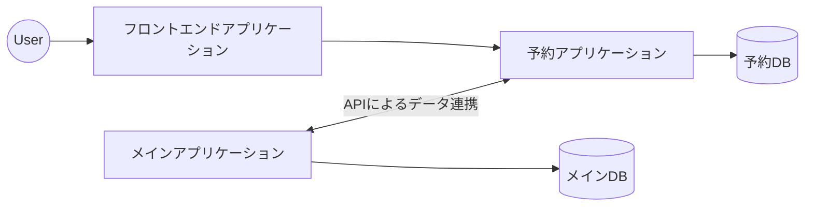
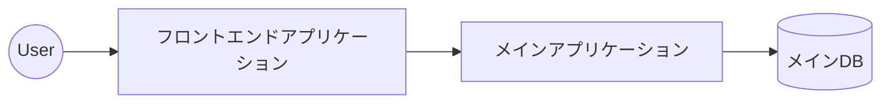
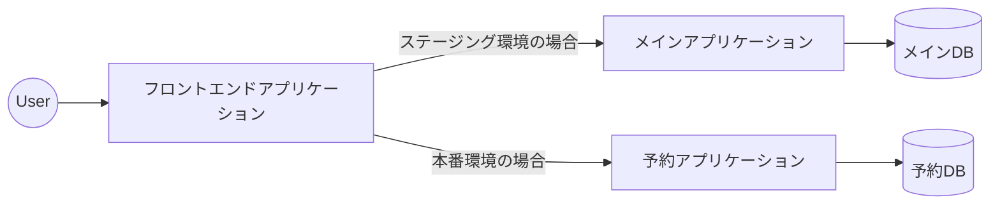

## はじめに

こんにちは！フィッツプラス開発部の伊藤です。

我々フィッツプラスは日々の開発業務の中で技術的負債の解消にも取り組んでいます。
今回のテックブログでは、本番環境で運用中の2つのシステムを1つに統合する取り組みに関してご紹介します。

### 対象読者

- マイクロサービスを運用していてサービスの統合を検討している方
- モノリスシステムを運用していてマイクロサービスへの移行を検討している方

## システム統合の背景・目的
### システム統合前のシステムアーキテクチャ



- メインの業務システム（メインシステム）と面談の予約管理を行う予約システムの2つに分かれて運用していた。
- ユーザーはSPA（シングルページアプリケーション）で構成されたフロントエンドアプリケーションから予約システムのバックエンドアプリケーションにリクエストを送ります。
- メインシステムと予約システムはRESTful APIによって、相互にデータ連携を行っている。
- また、開発体制としては1つの開発チームで2つのシステムのメンテナンスを行っている。
- 余談(?)
  - 予約システムだけ他社に外注して開発したという歴史的な背景があった。
  - そのため、予約管理という業務ドメインだけ別のサービスとして運用していた。
  - 初期開発は他社であったが、保守運用は自社で行っている。

### システム統合後のシステムアーキテクチャ



### システム統合の目的

- 開発のスピードを向上させるため
  - 2つのシステムにまたがって開発が必要な場合、データ連携用のAPIの実装やトランザクション管理（データの同期、ロールバックなど）などより多くのことを考慮して設計、実装する必要があります。
  - そのため、1つのシステムで実装するよりも開発工数がかかってしまうことがありました。
  - 今後も中長期的に開発を継続する想定があったため、開発スピードを向上させる必要がありました。
- チームの規模と合わせるため
  - 現在のフィッツプラスでは1つの開発チームで複数のシステムを管理しています。
  - そのため、チームを跨いだコミュニケーションや意思決定をすることがなく、マイクロサービスのメリットの1つである「独立してデプロイ可能であること」があまり享受できていませんでした。
- インフラコスト、メンテナンスコストの削減
  - メインシステムと予約システムのそれぞれでデータベースやアプリケーションサーバーを用意していました。
  - そのため1つにシステムを統合することができれば、インフラコストが単純に削減することができます（統合によってメインシステムのスペックは変えない想定です）
  - また、管理するシステムが減ることでOS、ライブラリなどのメンテナンスコストを削減したり、システムアーキテクチャの複雑性を下げて開発者への認知負荷を削減することもできます。

## システム統合の戦略

- ストラングラーフィグパターン（ストラングラーパターンとも呼ばれる）を用いて、ユーザーへの影響を最小限にシステムを安全に移行する
- ストラングラーフィグパターンとは？
- 予約システムのすべての機能をまとめてメインシステムで処理するように変更するようなビックバンリリースでは障害発生のリスクを高めてしまいます。段階的に機能を移行することで障害発生リスクを抑え、ユーザーへの影響を小さくすることができます。
- また、システム統合とは別の開発プロジェクトも並列で動いており、コードベースでのコンフリクト発生も最小限にする必要がありました。ストラングラーフィグパターンでは段階的にメインブランチにコードをマージしていくため、コンフリクト解消という手間も減らすことができます。

## 統合の手順

1. メインシステムに予約管理ドメインのAPIを実装。メインシステムからはメインデータベースと予約ドメインのデータベースの両方に接続した状態となる。まだメインシステムでの予約ドメイン機能は公開されていません。
   ```mermaid
   graph LR

   user((User)) --> spa["フロントエンドアプリケーション"]
   spa --> sys2

   sys2[予約アプリケーション] --> db2[(予約DB)]

   sys1[メインアプリケーション] -->|従来の機能| db1[(メインDB)]
   sys1 -->|予約ドメイン機能| db2

   sys1 <-->|APIによるデータ連携| sys2
   ```

2. フロントエンドアプリケーションからリクエスト先のエンドポイントを切り替える。予約システムのバックエンドアプリケーションにはアクセスがなくなるため、アプリケーション間のデータ連携が不要になります。
   ```mermaid
   graph LR

   user((User)) --> spa["フロントエンドアプリケーション"]
   spa --> sys1

   sys2[予約アプリケーション] --> db2[(予約DB)]

   sys1[メインアプリケーション] -->|従来の機能| db1[(メインDB)]
   sys1 -->|予約ドメイン機能| db2
   ```
  ※リクエスト先のエンドポイントを変えるのではなく、プロキシサーバー等を利用してリクエストを振り分ける方法もあります。今回のプロジェクトではAWS ALBを使ってリクエストのルーティングを行おうとしたのですが、うまくできない事情がありフロントエンドにてリクエスト先のエンドポイントを切り替えるという方法にしました。

3. 予約ドメインのデータベースからメインデータベースへデータ移行。
   ```mermaid
   graph LR

   user((User)) --> spa["フロントエンドアプリケーション"]
   spa --> sys1

   sys2[予約アプリケーション] --> db2[(予約DB)]

   sys1[メインアプリケーション] -->|従来の機能| db1[(メインDB)]
   sys1 -->|予約ドメイン機能| db2
   db2 ==>|データ移行| db1
   ```

4. メインシステムから接続するデータベース先を1つに変更
   ```mermaid
   graph LR

   user((User)) --> spa["フロントエンドアプリケーション"]
   spa --> sys1

   sys2[予約アプリケーション] --> db2[(予約DB)]

   sys1[メインアプリケーション] -->|すべての機能| db1[(メインDB)]
   ```

5. 後片付け。不要になったインフラリソースの削除など

   ```mermaid
   graph LR

   user((User)) --> spa["フロントエンドアプリケーション"]
   spa --> sys1


   sys1[メインアプリケーション] --> db1[(メインDB)]
   ```


## デプロイとリリースを分けて段階的に移行を進める

ストラングラーフィグパターンを用いて段階的にシステム統合を進めるにあたり、「デプロイとリリースを分けて進める」ことが重要です。

前節での手順1では、予約ドメイン機能をメインシステムに実装したらこまめに本番環境へデプロイしていました。
ただし、本番環境では予約ドメイン機能APIへのアクセスは404エラーを返却するようにして新しい機能へのアクセスはブロックします。

また、ステージング環境（動作検証用の環境）での動作検証を行うため、フロントエンドアプリケーションでも同様の対応をしていました。
ステージング環境ではメインシステムへリクエスト、本番環境では従来通り予約システムへをリクエストを送るように設定することにより、デプロイとリリースを分けるようにしていました。



デプロイとリリースを分けることにより、コードベースでのコンフリクト発生が抑えられたり、プルリクエストを細かくすることができるのでレビュー負荷を低減することができました。

## さいごに

マイクロサービスを運用しているとサービスを増やすだけではなく、逆にサービスを減らすことも出てくるかもしれません。
どちらの場合でもストラングラーパターンを用いることで本番環境での障害リスクを減らし、安全に段階的にシステムを移行していくことができます。

フィッツプラスでは新規機能開発を進めるだけでなく、今回のようなシステム統合など技術的負債を解決する取り組みも行っています。
このような取り組みに興味がある方はぜひカジュアル面談にてお話しましょう！

詳しくは下記採用ページをご確認ください。

（採用ページへのリンク）
