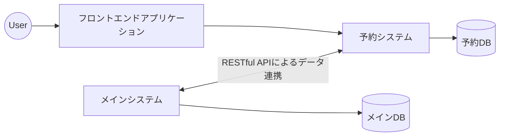
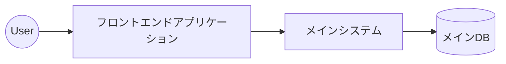
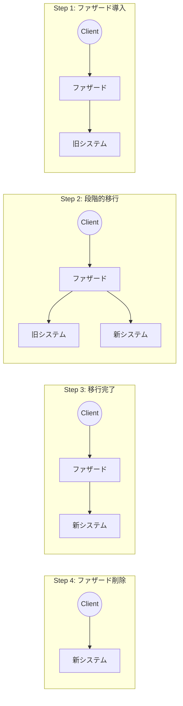
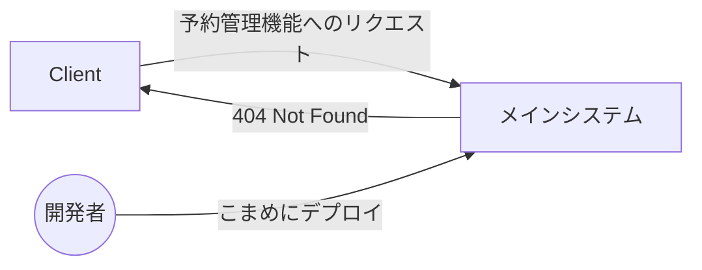

## はじめに

こんにちは！フィッツプラス開発部の伊藤です。

我々フィッツプラスは日々の開発業務の中で、長期的にシステムの機能開発を継続するため、システムのリアーキテクチャにも取り組んでいます。
今回のテックブログでは、本番環境で運用中の2つのシステムを1つに統合した取り組みに関してご紹介します。

今回のシステム統合ではストラングラーフィグパターンを用いることで、2つのシステムを安全に、ダウンタイムを最小限に抑えながら移行することができました。

この記事では以下の内容をお伝えします。

- アーキテクチャの変更の概要とその目的
- ユーザーへの影響を少なく、安全にシステム統合を行うためのストラングラーフィグパターン
- 具体的なシステム統合の手順
- デプロイとリリースを分けて段階的に移行を進める工夫

## システム統合の概要・目的
### システム統合前のシステムアーキテクチャ

まず、システム統合前のアーキテクチャに関して説明します。

システム統合前はメインの業務システム（メインシステム）と予約システムの2つに分かれて運用していました。予約システムは、予約管理機能だけを担う別サービス（マイクロサービス）です。

ユーザー向けのフロントエンドアプリケーションはNuxt.jsによるSPA（シングルページアプリケーション）で、予約システムにリクエストを送ります。
また、メインシステムと予約システムはRESTful APIによって、相互にデータ連携を行います。

また、開発組織はシステムごとに分かれておらず、1つの開発チーム（約5名）で2つのシステムのメンテナンスを行っていました。




### システム統合後のシステムアーキテクチャ

今回のシステム統合によって、予約システムが提供していた予約管理機能をメインシステムへ移行することを目指しました。
それに伴い、予約DBもメインDBに移行します。

下図のようにシンプルなアーキテクチャになります。



### システム統合の目的

システム統合を行うには多くの時間とコストがかかりますが、以下のような3つの目的を達成するべくシステム統合を行うと決断しました。

- システムの複雑性を下げ、機能改修における開発スピードを向上させるため
- インフラコスト、メンテナンスコストの削減
- マスターデータの統合

まず、1つ目の「システムの複雑性を下げ、機能改修における開発スピードを向上させるため」について説明します。

2つのシステムにまたがった機能開発を行う場合、データ連携用のAPIの実装やトランザクション管理（データの同期、ロールバック時のデータリカバリなど）を考慮して設計、実装する必要があります。その結果、システムの複雑度が上がり、1つのシステムで実装する場合よりも開発工数がかかってしまいます。

システムを1つにすると、データ連携用のAPIは不要になり、内部参照するだけで実装できるようになります。さらに、データベースが1つになることで、データの変更は1つのトランザクション内で処理でき、トランザクション管理も容易になります。

ちなみに、マイクロサービスのメリットの1つに「独立してデプロイ可能であり、チーム間のコミュニケーションコストを下げられること」があります。しかし、フィッツプラスでは1つの開発チームで2つのシステムを開発していました。そのため、チームをまたいだコミュニケーションや意思決定をすることがなく、デプロイに関する調整コストは低い状態でした。

そして、2つ目の「インフラコスト、メンテナンスコストの削減」についてです。

メインシステムと予約システムのそれぞれでデータベースサーバーやアプリケーションサーバーを用意していました。そのため、システムを統合することができれば、予約システム分のインフラコストを削減することができます（統合によってメインシステムのスペックは変えない想定です）。

また、管理するシステムが減ることで、ライブラリのバージョンアップ作業などのメンテナンスコストを削減することができます。

最後に、3つ目の「マスターデータの統合」についてです。

顧客情報などのマスターデータはメインシステムと予約システムで別々のデータベースに保存されていました。もともと予約システムはメインシステムとは別の経緯で開発されたものであり、後からメインシステムとの連携機能を実装したという歴史的な背景がありました。

マスターデータを管理するシステムが2つに分かれていることでデータの不整合が発生したり、不整合データが生まれないようにチェックする運用が行われていました。今回のシステム統合ではマスターデータの統合まではスコープ外としましたが、システム統合後によりマスターデータの統合のハードルを下げることができます。

以上のような目的を達成するべく、システム統合を行うことを決めました。

## ストラングラーフィグパターン

システム統合は「ストラングラーフィグパターン」を用いることで、ユーザーへの影響を最小限にしながら行いました。

ストラングラーフィグパターンとは、段階的にシステム移行を進めるためのアプローチ手法です。モノリスをマイクロサービスへ段階的に移行する際に特に用いられるようです。「モノリスからマイクロサービスへ」という書籍で詳しく解説されています。今回は「モノリスからマイクロサービスへ」ではなく「マイクロサービスからモノリスへ」の移行ですが、段階的にシステム移行を進める手法として非常に参考になりました。

ストラングラーフィグパターンでは以下の順序で移行を行います。

1. 旧システム、新システムの呼び出しを仲介するファザードを導入する。最初はすべてのリクエストは旧システムへルーティングする。
2. 新システムに機能を移行し、ファザードは段階的に新システムへリクエストをルーティングする。移行途中では、旧システムと新システムのどちらにもリクエストがルーティングされている。
3. すべての機能が新システムに移行されると、旧システムにはリクエストがたどり着かなくなるので、旧システムを停止する。
4. ファザードを削除し、移行が完了する。



今回のシステム統合でストラングラーフィグパターンには多くのメリットがありました。

予約システムのすべての機能をまとめてメインシステムに移行するビッグバンリリースでは障害発生のリスクを高めてしまいます。段階的に機能を移行することで障害発生リスクを抑え、ユーザーへの影響を小さくすることができます。

また、システム統合とは別の開発プロジェクトも並列で動いており、コードベースでのコンフリクト発生も最小限にする必要がありました。ストラングラーフィグパターンでは段階的にメインブランチにコードをマージしていくため、コンフリクト解消という手間も減らすことができます。

## システム統合の手順

ストラングラーフィグパターンをベースに以下のような手順で行いました。なお、ファザードの役割はフロントエンドアプリケーションが担っています。

1. メインシステムに予約管理機能のAPIを実装します。メインシステムからはメインデータベースと予約システムのデータベースの両方に接続します。まだメインシステムでの予約管理機能は公開されていません。
   ```mermaid
   graph LR

   user((User)) --> spa["フロントエンドアプリケーション"]
   spa --> sys2

   sys2[予約システム] --> db2[(予約DB)]

   sys1[メインシステム] -->|従来の機能| db1[(メインDB)]
   sys1 -->|予約管理機能| db2

   sys1 <-->|APIによるデータ連携| sys2
   ```

2. フロントエンドアプリケーションからリクエスト先のエンドポイントを切り替えます。予約システムにはリクエストが飛ばなくなるため、予約システム（アプリケーションサーバーのみ）を停止することができます（データベースは稼働したままです）。
   ```mermaid
   graph LR

   user((User)) --> spa["フロントエンドアプリケーション"]
   spa --> sys1

   sys2[予約システム] --> db2[(予約DB)]

   sys1[メインシステム] -->|従来の機能| db1[(メインDB)]
   sys1 -->|予約管理機能| db2
   ```

   より具体的にはユーザーの種類ごとにエンドポイントの切り替えを行いました。すべてのユーザーに対して一気にエンドポイントを切り替えるのではなく、まずは社内ユーザーのみ切り替えて、エラーが発生しないか確認しました。

   その結果、社内ユーザーのみを切り替えた際にエラーが発生してしまったのですが、すぐにロールバックでき、影響を社内ユーザーに留めることができました。

   > [!NOTE]
   > リクエスト先のエンドポイントを変えるのではなく、プロキシサーバー等を利用してリクエストを振り分ける方法もあります。最初はAWS ALBを使ってリクエストのルーティングを行おうとしたのですが、ALBとは異なるVPCにあるターゲットグループにルーティングできませんでした。そのため、フロントエンドアプリケーションにてリクエスト先のエンドポイントを切り替えるという方法にしました。

3. 予約システムのデータベースからメインデータベースへデータを同期します。詳細は割愛しますが、AWS Data Migration Serviceというデータ移行用のサービスを使ってデータの同期を行いました。

   とある時点でのスナップショットを移行するフルロード（全件を一括で移行する方式）と、差分データを同期するCDC（Change Data Capture。変更差分を取り込む方式）を組み合わせて移行しました。
   ```mermaid
   graph LR

   user((User)) --> spa["フロントエンドアプリケーション"]
   spa --> sys1

   sys2[予約システム] --> db2[(予約DB)]

   sys1[メインシステム] -->|従来の機能| db1[(メインDB)]
   sys1 -->|予約管理機能| db2
   db2 ==>|データ移行（フルロード＆CDC）| db1
   ```

4. メインシステムからのデータベース接続先をメインDBのみに変更します。これにより、すべての予約管理機能はメインシステムとメインDBによって提供されます。

   ただし、メインDBから予約DBへのデータ同期は行われないため、予約DBは接続が切れた時点のままとなります。もし、この時点でのロールバックを考慮するのであれば、予約DBからメインDBへ同期する仕組みも用意しておく必要があります。
   ```mermaid
   graph LR

   user((User)) --> spa["フロントエンドアプリケーション"]
   spa --> sys1

   sys2[予約システム] --> db2[(予約DB)]

   sys1[メインシステム] -->|すべての機能| db1[(メインDB)]
   ```
   この切り替え作業に限っては、データの不整合が発生しないように移行するため、システムを一時的に停止して行いました。

5. 不要になった予約システムのインフラリソースを削除します。

   ```mermaid
   graph LR

   user((User)) --> spa["フロントエンドアプリケーション"]
   spa --> sys1


   sys1[メインシステム] --> db1[(メインDB)]
   ```

## デプロイとリリースを分けて段階的に移行を進める

ストラングラーフィグパターンを用いて段階的にシステム統合を進めるにあたり、「デプロイとリリースを分けて進める」ことが重要です。

前節での手順1では、予約管理機能をメインシステムに実装したらこまめに本番環境へデプロイしていました。
ただし、本番環境では予約管理機能APIへのアクセスは404エラーを返却するようにして新しい機能は非公開にしていました。これにより、デプロイとリリースを分けて進めることができました。



デプロイとリリースを分けることにより、コードベースでのコンフリクト発生が抑えられたり、プルリクエストを細かくすることができるのでレビュー負荷を低減することができました。

## さいごに

今回の記事では、ストラングラーフィグパターンを用いてマイクロサービスとなっているシステムを1つに統合した事例を紹介しました。

段階的にシステムを移行することで、万が一エラーが発生した場合でも影響を小さくでき、ロールバックも行いやすくなります。実際にリリースに伴う障害は一度発生しましたが、その影響は社内ユーザーに留まり、外部ユーザーへの影響はありませんでした。

システムのリアーキテクチャを行う際に参考にしていただけると幸いです。
